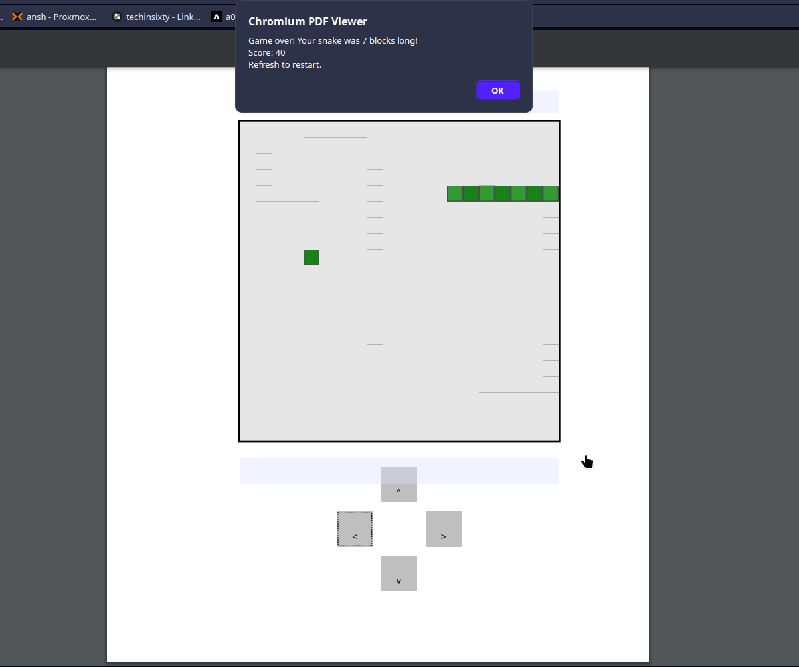

# 🐍 Snake in a PDF

This is a fully playable Snake game embedded inside a PDF file, using form field objects and JavaScript keystroke events.

## 💡 How It Works

Inspired by the brilliant [Tetris in a PDF](https://th0mas.nl/2025/01/12/tetris-in-a-pdf/) by [Th0mas](https://th0mas.nl), this version uses the same approach:
- The game is rendered using monochrome form fields.
- Player input is captured via keyboard entry in a text field.
- No external dependencies — it all runs inside the PDF viewer.

> **Note:** Works best in Chromium-based PDF viewers (PDFium) and Firefox (PDF.js). Not guaranteed to work in Adobe Acrobat or other viewers.

## How to run?
Compile and run the snake_game.py to generate the game pdf or simply download it from the repo 

## 🎮 Controls

Use arrow keys to control the snake.

- ⬅️ Left  
- ➡️ Right  
- ⬆️ Up  
- ⬇️ Down  

Make sure the input field is focused!

## 📷 Preview

![demo]

  
  

## 📄 Credits

- **Original concept**: [Tetris in a PDF](https://th0mas.nl/2025/01/12/tetris-in-a-pdf) by [Th0mas](https://th0mas.nl)
- **Snake adaptation**: [neonite](https://github.com/neonite2217)

## 📜 License

[MIT](LICENSE)
